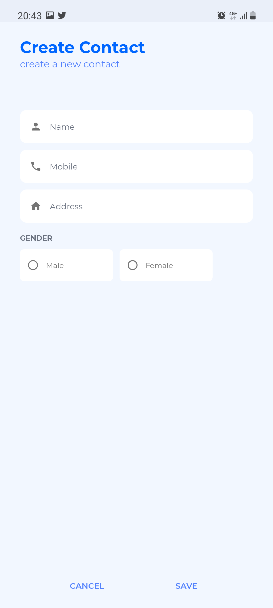
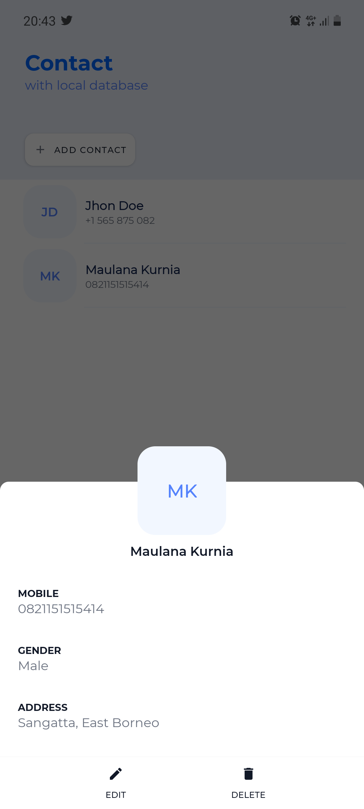
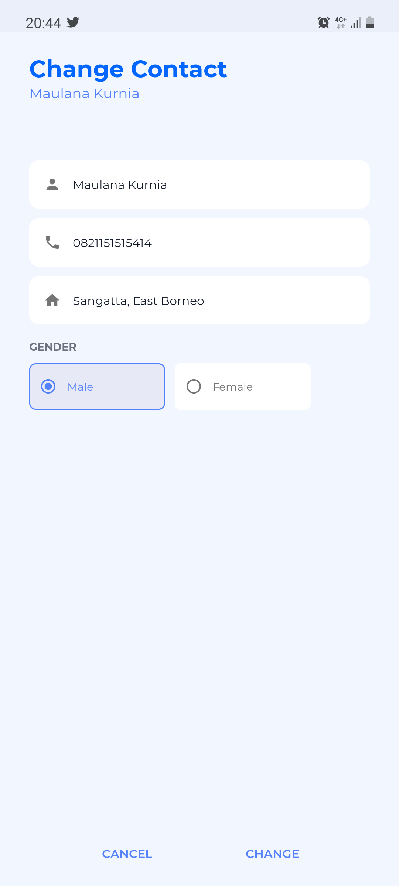
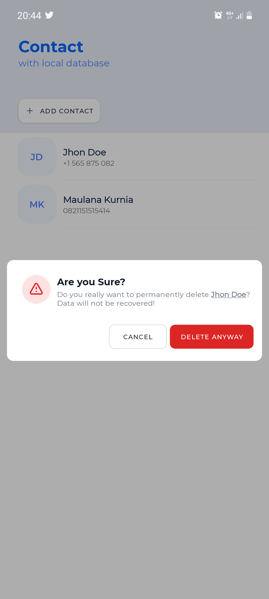

# Contact 
## Room Database Implementation (SQLite)

## Author
123180176  
Maulana Kurnia Fiqih Ainul Yaqin

## App Overview
- Home 

- Create Contact

- Profile (Detail Contact)

- Change Contact

- Delete Contact

